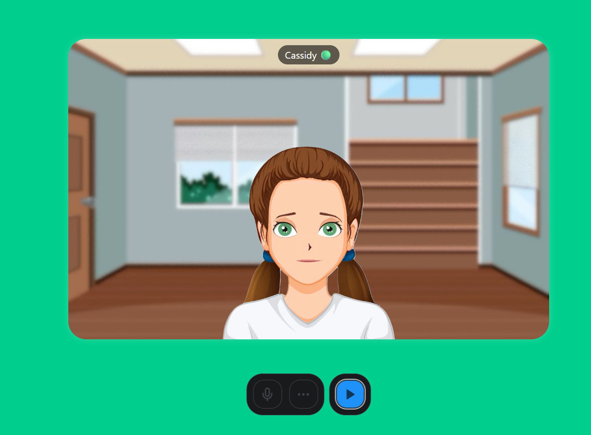
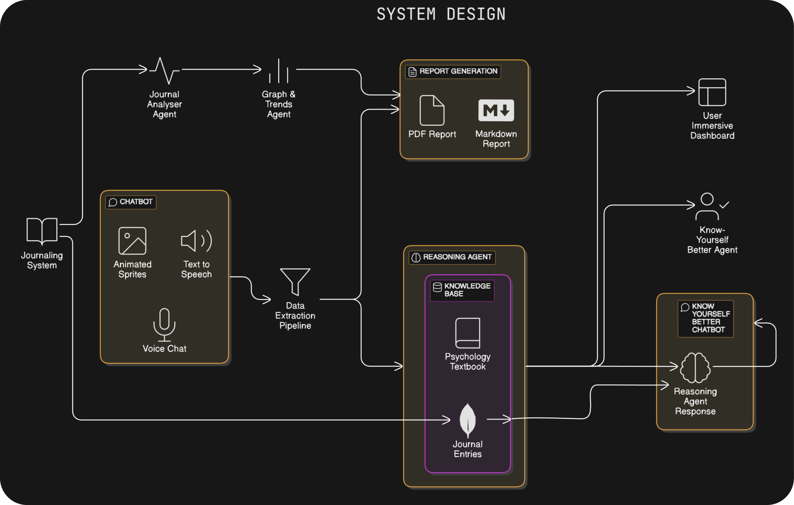

# SoulScript

A sophisticated AI-powered platform that combines journaling capabilities with persona management, built with Next.js, Python, and modern web technologies.

## Project Overview

PersonaBot_Pegasus is a multi-component application that provides:
- Real-time chat interactions with AI personas, with translation in 57 languages.
- AI-powered journaling and personal reflection
- Interactive persona management and visualization
- Safety monitoring and content filtering


## Tech Stack

### Frontend
- Next.js 15
- React 19
- TypeScript
- Tailwind CSS
- Radix UI Components

### Backend
- Python 3.x
- MongoDB
- GenAI Integration (Gemini, Stack AI)
- Google Cloud Platform

## Prerequisites

- Git
- Python 3.x
- MongoDB
- Node.js (Latest LTS version recommended)
- npm or yarn

## Getting Started

1. Clone the repository:
```bash
git clone https://github.com/yourusername/PersonaBot_Pegasus.git
cd PersonaBot_Pegasus
```

2. Set up each component:

### Journal App
```bash
cd journal-app
npm install
cp .env.example .env
# Edit .env with your configuration
npm run dev
```
now head to http://localhost:3002 or https://v0-mongo-db-journal-app.vercel.app/

### Persona Dashboard
```bash
cd PersonaDashboard
npm install
cp .env.example .env
# Edit .env with your configuration
npm run dev
```
now head to http://localhost:3001 for know yourself better chat and http://localhost:3001/dashboard to see user persona dashboard 

### Interactive Chatbot
Start frontend using

```bash
cd InteractiveChatbot
cp .env.example .env
# Edit .env with your configuration
npm run dev
```
Then run backend using the following commands
Note: the rhubarb binaries require backend to be run on a linux machine. Use wsl if you are using windows.
```bash
cd backend
pip install -r requirements.txt
cp .env.example .env
# Edit .env with your configuration
python3 main.py
```

now head to http://localhost:3000/chat


## Environment Variables

Each component requires its own environment variables. See the respective component's `.env.example` file for details:

- [Persona Dashboard Environment Variables](PersonaDashboard/.env.example)
- [Interactive Chatbot Environment Variables](InteractiveChatbot/.env.example)


## Project Structure

```
PersonaBot_Pegasus/
├── journal-app/          # Main journaling application
├── PersonaDashboard/     # AI-powered persona management dashboard
├── InteractiveChatbot/   # Chat interface for persona interactions
├── NVIDIA_guardrail/     # Safety and monitoring components
└── .gitignore
```

## Security

- All API keys and sensitive credentials are managed through environment variables
- `.env` files are gitignored to prevent accidental commits of sensitive data
- API endpoints are protected with proper authentication
- Rate limiting and content filtering are implemented
- Regular security updates and monitoring

## Contributing

1. Fork the repository
2. Create your feature branch (`git checkout -b feature/AmazingFeature`)
3. Commit your changes (`git commit -m 'Add some AmazingFeature'`)
4. Push to the branch (`git push origin feature/AmazingFeature`)
5. Open a Pull Request


## Acknowledgments

- OpenAI for AI capabilities
- MongoDB for database solutions
- The Next.js team for the amazing framework
- Google for Gemini AI
- Stack AI for inference capabilities
- All contributors and maintainers

## Support

For support, please open an issue in the GitHub repository or contact the maintainers. 