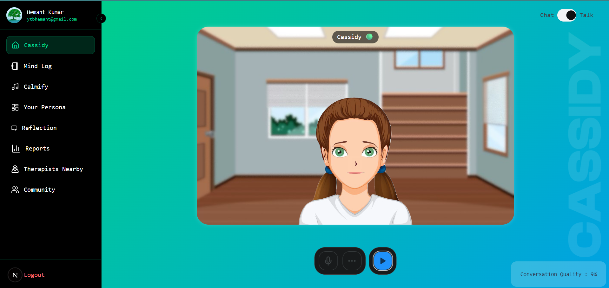
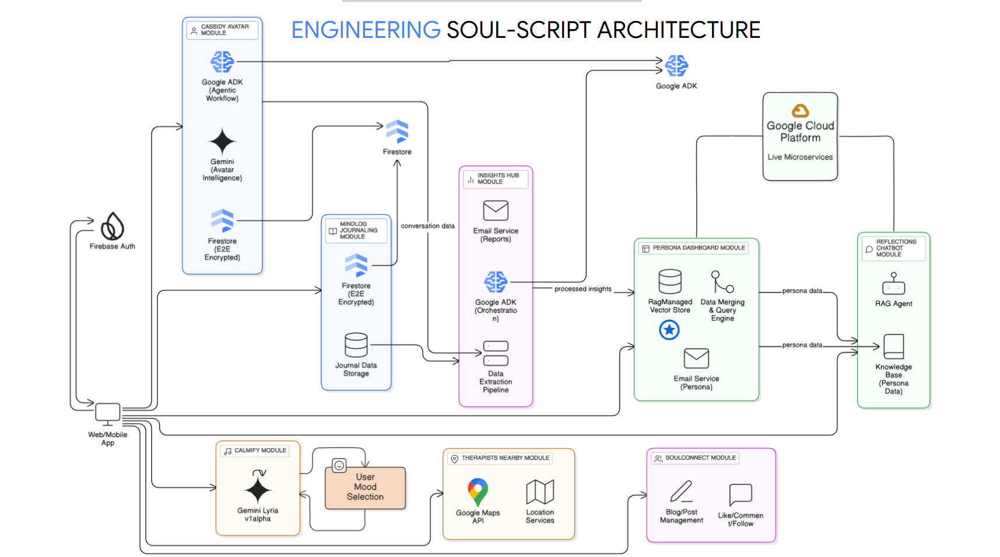

# 🍀SoulScript
> "Mental health issues don’t always scream, sometimes they whisper"
> 
SoulScript is an intelligent AI-powered mental wellness platform designed to offer a safe space for self-reflection, support, and emotional healing. It combines journaling, intelligent avatars, AI-assisted therapy, and mood-driven tools to help users better understand and nurture their mental well-being.
Have a look at the [**demo**](https://www.youtube.com/watch?v=bJ5IWUYLzlE)


## 🚀 Features
- 🧠 **Cassidy (AI Therapist)**
A real-time conversational AI chatbot designed to understand, empathize, and support you on your mental health journey.

- 📔 **MindLog (AI Journaling)**
Reflect on your daily thoughts and emotions with an intelligent journaling assistant that helps surface patterns and insights.

- 🎵 **Calmify (Mood-Based Music Generator)**
Enjoy personalized music composed in real time based on your mood and emotional state using Google’s Lyria AI.

- 🧬 **Persona Dashboard**
Visualize and manage your evolving AI-inferred persona, based on your journaling and interactions.

- 📍 **Therapists Near You**
Use location-based tools to discover licensed mental health professionals in your area.

- 🤝 **Community**
Share your thoughts, connect with others, and seek support in a dedicated, mental-health-focused social environment.

- 🪞 **Reflections Chatbot**
An introspective chatbot that helps you learn more about yourself by analyzing your past journaling data and persona activity.


## Tech Stack
- Next.js
- React
- TypeScript
- TailwindCSS
- Firestore
- GenAI Integration (Gemini)
- Python Flask server
- Fast API
- Google ADK
- Google Maps API
- Google Lyria Music Generation
- Google Cloud Platform


## Usage
### Runnning Frontend
1. Clone the repository:
```sh
git clone https://github.com/HemantKumar01/SoulScript.git
cd SoulScript
```
2. Install dependencies:
```sh
cd WebApp
npm install
```
3. Create a `.env` file in the `WebApp` directory and add the following environment variables:
```env
NEXT_PUBLIC_GEMINI_API_KEY=
NEXT_PUBLIC_FIREBASE_API_KEY=
NEXT_PUBLIC_FIREBASE_AUTH_DOMAIN=
NEXT_PUBLIC_FIREBASE_PROJECT_ID=
NEXT_PUBLIC_FIREBASE_STORAGE_BUCKET=
NEXT_PUBLIC_FIREBASE_MESSAGING_SENDER_ID=
NEXT_PUBLIC_FIREBASE_APP_ID=
NEXT_PUBLIC_FIREBASE_MEASUREMENT_ID=
NEXT_PUBLIC_GOOGLE_MAPS_API_KEY=
NEXT_PRIVATE_REPORTGEN_CHATBOT=
NEXT_PUBLIC_REPORTGEN_CHATBOT=  
NEXT_PUBLIC_ENCRYPTION_KEY=
```
4. Start the development server:
```sh
npm run dev
```

### Running Cassidy Backend
1. install dependencies
```sh
cd backend/cassidy_adk
pip install -r requirements.txt
```
2. Create `.env` file having following content
```sh
GOOGLE_GENAI_USE_VERTEXAI=FALSE
GOOGLE_API_KEY=
```
3. Run server using
```sh
python main.py
```
### Running Persona Server
1. install dependencies
```sh
cd backend/persona_server
pip install -r requirements.txt
```
2. Create `.env` file having following content
```sh
EMAIL= # preferably gmail 
PASSWORD= #google app password not your gmail password
```
3. Run server using
```sh
fastapi run main.py
```
